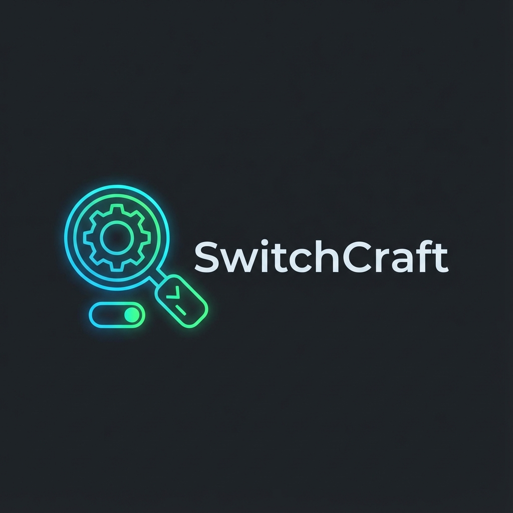

# SwitchCraft 🧙‍♂️



[](https://github.com/FaserF/SwitchCraft/releases)

**SwitchCraft is your comprehensive packaging assistant for IT Professionals. It goes beyond simple switch identification to streamline your entire application packaging workflow:

- 🔍 **Universal Analysis**: Instantly identify silent switches for EXE, MSI, and obscure installer frameworks.
- 🤖 **AI-Powered Helper**: Get context-aware packaging advice and troubleshooting for Intune errors.
- 📦 **Intune Ready**: Generate standardized PowerShell installation scripts automatically.
- 🌍 **Cross-Platform**: Download and manage installers for Windows, Linux, and macOS.
- 🛡️ **Integrity & Security**: Brute-force analysis for undocumented installers and file integrity checks.


<div align="center">
  
</div>

> [!NOTE]
> **Active development is for Windows only.** Linux and macOS builds are untested but available. Bug reports for other platforms are welcome!

## ✨ Features

- **🔎 Universal Analysis**:
  - **MSI**: Extracts `ProductCode`, `UpgradeCode`, manufacturer, version, and standard `/qn` switches
  - **EXE**: Auto-detects 20+ installer frameworks and suggests appropriate silent switches
  - **Metadata**: Parses PE version info for product name, version, and company
- **📦 Winget Integration**: Automatically checks if the package exists in the **Windows Package Manager** (winget) repository
- **🖥️ GUI & Drag'n'Drop**: Modern, dark-mode friendly desktop interface
- **⚔️ Automatic Brute Force**: Runs 15+ help argument variations to discover switches
- **🌐 Multi-Language**: English and German interface

## 🎯 Supported Installer Types

### Standard Installers

| Installer Type | Detection Confidence | Silent Install Switch |
|---------------|---------------------|----------------------|
| **MSI Database** | 100% | `/qn /norestart` |
| **NSIS** | 90% | `/S` |
| **Inno Setup** | 90% | `/VERYSILENT /SUPPRESSMSGBOXES /NORESTART` |
| **InstallShield** | 80% | `/s /v"/qn"` |
| **7-Zip SFX** | 90% | `/S` |
| **WiX Burn Bundle** | 85% | `/quiet /norestart` |
| **Advanced Installer** | 80% | `/exenoui /qn` |
| **Wise Installer** | 80% | `/S` |
| **Setup Factory** | 75% | `/S` |
| **Squirrel (Electron)** | 80% | `--silent` |

### Vendor-Specific Installers

| Vendor | Detection Confidence | Silent Install Switch |
|--------|---------------------|----------------------|
| **HP SoftPaq** | 85% | `-s -e <extract_path>` |
| **Dell Update Package** | 85% | `/s /l=<logfile>` |
| **SAP** | 80% | `/Silent` |
| **Lenovo** | 80% | `/SILENT /VERYSILENT /NOREBOOT` |
| **Intel** | 80% | `-s -a -s2 -norestart` |
| **NVIDIA** | 80% | `-s -noreboot -clean` |
| **AMD/ATI** | 75% | `/S` |
| **Visual C++ Redist** | 90% | `/quiet /norestart` |
| **Java/Oracle** | 80% | `/s INSTALL_SILENT=1` |

### Packaged Applications (Not Installers)

| Type | Detection Confidence |
|------|---------------------|
| **PyInstaller App** | 85% |
| **cx_Freeze App** | 80% |

## 🚀 Installation

### Pre-built Binaries
Download from the [Releases](https://github.com/FaserF/SwitchCraft/releases) page:

#### Windows Installer (Recommended)
- **`SwitchCraft-Setup.exe`** – Full installer with Start Menu, Desktop shortcuts, and Add/Remove Programs entry

| Install Mode | Default Location | How to trigger |
|-------------|------------------|----------------|
| **User** | `%LOCALAPPDATA%\FaserF\SwitchCraft` | Just run the installer |
| **Admin** | `C:\Program Files\FaserF\SwitchCraft` | Run as Administrator |

**Silent Install:**
```powershell
# Standard silent install
SwitchCraft-Setup.exe /VERYSILENT /SUPPRESSMSGBOXES /NORESTART

# Silent install with debug logging enabled
SwitchCraft-Setup.exe /VERYSILENT /SUPPRESSMSGBOXES /NORESTART /DEBUGMODE
```


**Silent Uninstall:**
```powershell
# Standard Silent Uninstall
"%LOCALAPPDATA%\FaserF\SwitchCraft\unins000.exe" /VERYSILENT /SUPPRESSMSGBOXES /NORESTART

# Via SwitchCraft.ps1 Helper Script
.\SwitchCraft.ps1 -InstallMode Uninstall
```

#### Debug Logging Mode
Enable verbose structured logging for troubleshooting or log analysis:

| Method | How to enable |
|--------|---------------|
| **Installer checkbox** | Select "Enable Debug Logging" during installation |
| **Silent install** | Add `/DEBUGMODE` or `/DEBUGMODE=1` parameter |
| **Environment variable** | Set `SWITCHCRAFT_DEBUG=1` |
| **Command line** | Run with `--debug` or `-d` flag |

Debug output format:
```
[2025-12-16 23:00:00] [INFO    ] [main] SwitchCraft v2025.12.5 - Debug Log
[2025-12-16 23:00:00] [DEBUG   ] [exe] Analyzing: C:\path\installer.exe
[2025-12-16 23:00:00] [DEBUG   ] [exe] Detected: NSIS (confidence: 90%)
```

#### Portable Executables (No Install)
- **Windows**: `SwitchCraft-windows.exe`
- **Linux**: `SwitchCraft-linux`
- **macOS**: `SwitchCraft-macos`

#### Install via Winget
```powershell
winget install FaserF.SwitchCraft
```

#### CLI "One-Liner" (PowerShell)
Install the latest version directly from your terminal:
```powershell
iex (irm https://raw.githubusercontent.com/FaserF/SwitchCraft/main/install.ps1)
```

**Installer Script Parameters:**
The install script supports several optional parameters:
```powershell
# Install specific version (e.g. v2025.12.1)
.\install.ps1 -Version "v2025.12.1"

# Download Portable Version to Desktop instead of installing
.\install.ps1 -Portable

# Silent Mode (for automated deployments)
.\install.ps1 -Silent
```

### Enterprise Deployment

SwitchCraft is completely ready for modern management:
- **Intune Script Generation**: Automatically create `.intunewin` ready install/uninstall scripts (PowerShell) directly from the analysis result.
- **MacOS Support**: Generate `install.sh` scripts and `.mobileconfig` profiles for Intune management of Mac apps.
- **Custom Templates**: Use your own company-branded PowerShell templates for script generation (configure in Settings).

| Documentation | Description |
|---------------|-------------|
| [Registry Reference](docs/Registry.md) | All registry values and settings |
| [GPO / Intune Policies](docs/PolicyDefinitions/README.md) | OMA-URI configuration and ADMX templates |

## 🍎 MacOS Support
SwitchCraft runs on MacOS (build from source or use binary releases) and supports analysis of:
- **.dmg** (Disk Images) - Detects mountable apps
- **.pkg** (Installer Packages) - Extracts Package IDs and Version
- **.app** (Bundles) - Reads Info.plist metadata

> **Note**: While the app runs on MacOS, "Silent Switch" detection is primarily a Windows concept. On MacOS, it helps generate deployment scripts.

> [!WARNING]
> ### ⚠️ False Positive Virus Warnings
>
> SwitchCraft may trigger security warnings from browsers, operating systems, or antivirus software. **This is a false positive** – the application is completely safe.

#### Why this happens

<details>
<summary><b>🌐 Google Chrome / Edge</b> – "This file may be dangerous"</summary>

Chrome uses **Safe Browsing** which flags files based on:
- **Download frequency**: New/rarely downloaded files are flagged regardless of content
- **Unsigned executables**: SwitchCraft doesn't have an expensive code-signing certificate
- **Executable type**: All `.exe` downloads trigger extra scrutiny

**Solution**: Click the `^` arrow → "Keep dangerous file" → "Keep anyway"
</details>

<details>
<summary><b>🪟 Windows SmartScreen</b> – "Windows protected your PC"</summary>

Microsoft SmartScreen blocks apps with low "reputation score" based on:
- **Unknown publisher**: No code-signing certificate = "Unknown Publisher"
- **Low download count**: New apps have no established reputation
- **Application behavior**: SwitchCraft reads PE headers and runs processes (for help text detection), which looks suspicious to heuristics

**Solution**: Click "More info" → "Run anyway"

> After many users click "Run anyway", SmartScreen learns the app is safe.
</details>

<details>
<summary><b>🛡️ Windows Defender / Microsoft Defender</b> – "Trojan:Win32/Wacatac.B!ml"</summary>

Defender's **machine learning models** flag SwitchCraft because:
- **PyInstaller-packaged apps** are commonly abused by malware
- **Process execution**: Running `installer.exe /?` to detect help text triggers behavioral detection
- **PE file parsing**: Reading executable metadata is similar to what malware does
- **Archive extraction**: Using 7-Zip to extract nested files resembles unpacking behavior

**Solution**: Add an exclusion in Windows Security → Virus & threat protection → Exclusions
</details>

<details>
<summary><b>🔒 Other Antivirus (Kaspersky, Avast, Norton, etc.)</b></summary>

Third-party AV software may flag SwitchCraft because:
- **Heuristic detection**: The combination of PE parsing + process spawning + file extraction triggers generic "suspicious behavior" rules
- **VirusTotal reputation**: Some AV vendors share detections, causing a cascade of false positives
- **UPX compression**: PyInstaller uses UPX to compress executables, which is also used by malware to hide code

**Solution**: Add SwitchCraft to your antivirus exclusion/whitelist
</details>

#### How to verify the file is safe

1. **Check the source**: Download only from [GitHub Releases](https://github.com/FaserF/SwitchCraft/releases)
2. **Verify the hash**: Compare SHA256 hash with the one published on the release page
3. **Scan on VirusTotal**: Upload to [virustotal.com](https://www.virustotal.com) – expect 2-5 detections on new releases (these decrease over time). If you see 30+ detections, it might be a real issue or modified file.
4. **Build from source**: Clone this repo and build yourself with `pyinstaller switchcraft.spec`. No Python coding knowledge required!

### From Source
```bash
git clone https://github.com/FaserF/SwitchCraft.git
cd SwitchCraft
pip install .
```

## 💻 Usage

### GUI Mode
Simply run the application without arguments:
```bash
switchcraft
# or
python -m switchcraft.gui.app
```
Then **Drag & Drop** your installer into the window or click to browse.

### CLI Mode
```bash
# Basic analysis
switchcraft analyze setup.exe

# JSON output for scripting
switchcraft analyze setup.exe --json

# Check version
switchcraft --version
```

## 🔧 Supported File Types

| Extension | Description |
|-----------|-------------|
| `.exe` | Windows Executable (installer or packaged app) |
| `.msi` | Windows Installer Database |

## ⚔️ Brute Force Parameter Discovery

When no installer type is detected, SwitchCraft automatically tries these help arguments:

```
/?  --help  -h  /help  /h  -?  --info  -help  --usage  -V  --version  /info  -i  --silent  /silent
```

The output is analyzed for common patterns and displayed in the GUI.

## 📦 Archive Extraction & Nested Analysis

If no silent switches are found for the main EXE, SwitchCraft will:

1. **Attempt to extract** the EXE using 7-Zip (treats EXE as a self-extracting archive)
2. **Scan for nested installers** (MSI, EXE) inside the extracted content
3. **Analyze each nested executable** for silent install parameters
4. **Display alternative installation instructions** showing which file to run

> [!TIP]
> Requires 7-Zip installed (`C:\Program Files\7-Zip\7z.exe`). If a main installer shows no switches but contains a nested MSI, you can extract it manually and run `msiexec /i nested.msi /qn`.

### Silent Installation Disabled Detection

SwitchCraft can detect when developers have **intentionally disabled** silent installation:
- Binary flags like `SilentModeDisabled`, `RequireGUI`
- Help text indicating "silent mode not supported"

## 🛠️ Development

### Prerequisites
- Python 3.9+
- Install dependencies: `pip install -e .[dev]`

### Running Tests
```bash
python -m unittest discover tests
```

### Building Executables Manually

#### Using PyInstaller (Recommended)
```bash
# Install PyInstaller and dependencies
pip install pyinstaller customtkinter tkinterdnd2 pillow

# Build using the spec file
pyinstaller switchcraft.spec

# The executable will be in dist/SwitchCraft.exe (Windows) or dist/SwitchCraft (Linux/Mac)
```

#### Using cx_Freeze (Alternative)
```bash
pip install cx_Freeze
python setup_freeze.py build
```

### Project Structure
```
SwitchCraft/
├── src/switchcraft/
│   ├── analyzers/        # Installer detection logic
│   │   ├── base.py       # Abstract base analyzer
│   │   ├── exe.py        # EXE analyzer (11+ installer types)
│   │   ├── msi.py        # MSI database analyzer
│   │   └── universal.py  # Brute force & wrapper detection
│   ├── gui/              # CustomTkinter GUI
│   │   └── app.py        # Main application window
│   ├── utils/            # Helper utilities
│   │   ├── i18n.py       # Internationalization
│   │   ├── updater.py    # Auto-update checker
│   │   └── winget.py     # Winget repository lookup
│   └── main.py           # CLI entry point
├── tests/                # Unit tests
└── switchcraft.spec      # PyInstaller build specification
```

## 📋 Release Types

SwitchCraft uses CalVer versioning: `YEAR.MONTH.PATCH[-suffix]`

| Release Type | Version Format | Example | Description |
|-------------|---------------|---------|-------------|
| **Stable** | `YYYY.MM.X` | `2025.12.3` | Production-ready release |
| **Pre-release (Beta)** | `YYYY.MM.X-beta` | `2025.12.4-beta` | Feature-complete but testing |
| **Development** | `YYYY.MM.X-dev` | `2025.12.5-dev` | Experimental builds |

> **Note**: Beta and development versions display a warning banner in the GUI.

## 🤝 Contributing
Open Source under the **MIT License**. PRs are welcome!

1. Fork the repository
2. Create your feature branch: `git checkout -b feature/amazing-feature`
3. Commit your changes: `git commit -m 'Add amazing feature'`
4. Push to the branch: `git push origin feature/amazing-feature`
5. Open a Pull Request

## 📜 License
MIT © 2025 FaserF

## 🔗 Links
- [GitHub Repository](https://github.com/FaserF/SwitchCraft)
- [Release Downloads](https://github.com/FaserF/SwitchCraft/releases)
- [Silent Install Database](https://silent.ls/)
