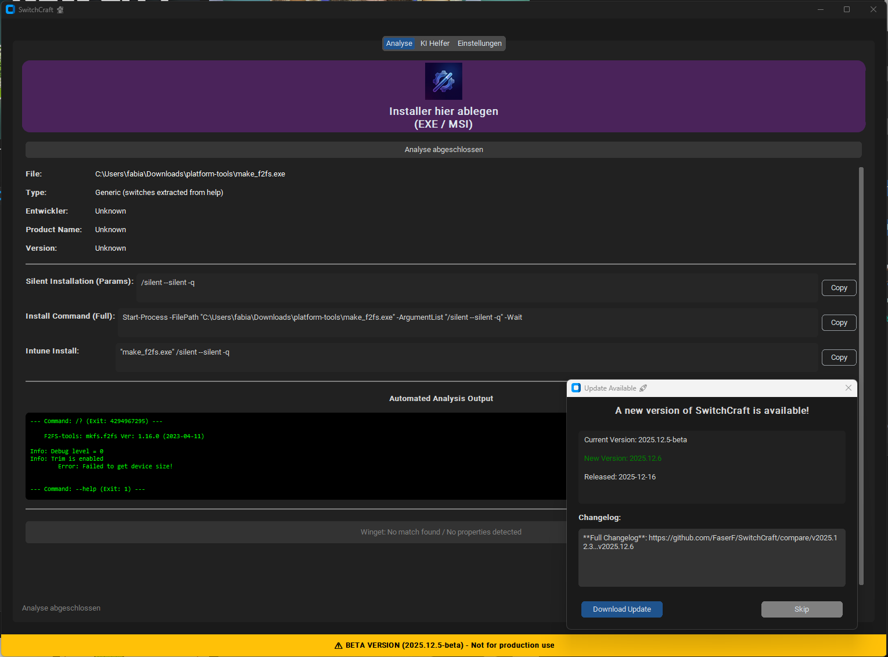

# SwitchCraft 🧙‍♂️


[](https://github.com/FaserF/SwitchCraft/releases)

**SwitchCraft is your comprehensive packaging assistant for IT Professionals. It goes beyond simple switch identification to streamline your entire application packaging workflow.**

<div align="center">
  
</div>

> [!NOTE]
> **Active development is for Windows only.** Linux and macOS builds are untested but available. Bug reports for other platforms are welcome!

## 📚 Documentation

- [**✨ Features & Analysis**](docs/FEATURES.md): Detailed breakdown of supported installers and analysis capabilities.
- [**🤖 CLI Reference**](docs/CLI_Reference.md): Command-line usage, JSON output, and headless operation.
- [**🏗️ CI Architecture**](docs/CI_Architecture.md): Build process, pip structure, and testing guide.
- [**📦 Winget Store & Integration**](docs/WINGET.md): Using the Winget Store and Auto-Update deployment.
- **Session Logs**: Track errors and warnings during your session and export them for troubleshooting.
- [**☁️ Enterprise & Intune**](docs/INTUNE.md): Guide to Automation, Intune Uploads, Group Assignments, and Script Signing.
- [**Registry Reference**](docs/Registry.md): Configuration via Registry.
- [**GPO / Policies**](docs/PolicyDefinitions/README.md): ADMX Templates.
- [**🔐 Security Guide**](docs/SECURITY.md): Details on Encryption, ASR, and Safe Usage.

## 🧩 Addons & Extensions

SwitchCraft uses a modular addon system for advanced features like **Intune Integration** and **AI Analysis**. This ensures the core tool remains lightweight and less prone to false-positive antivirus detections.

- **Manual Install**: You can upload custom addons in Settings.
- 👉 [**Read the Addon Guide**](docs/ADDONS.md) for more details.

## 📦 Release Artifacts & Versions

SwitchCraft is available in two distinct design versions. You can install both side-by-side or choose the one that fits your workflow.

### 🎨 Versions (Designs)

| Version | Design Engine | Description | Use Case |
| :--- | :--- | :--- | :--- |
| **Classic** | **Tkinter** | The original, battle-tested interface. Stable, feature-complete, and lightweight. | **Production**. Recommended for daily packaging tasks where stability is paramount. |
| **Modern** | **Flet (Flutter)** | A brand new, unified design language with animations and a modern aesthetic. Currently in **Preview/Beta**. | **Early Adopters**. Try this if you want to see the future of SwitchCraft or prefer a modern UI. |

### 📂 File Guide (Assets)

When you visit the [Releases Page](https://github.com/FaserF/SwitchCraft/releases), you will see several files. Here is what they do:

1.  **Application Executables**:
    *   `SwitchCraft-Setup.exe`: **(Recommended)** The classic installer. Handles shortcuts, uninstallation, and file associations.
    *   `SwitchCraft-windows.exe`: A portable version of the **Classic** app. No installation required.
    *   `SwitchCraft_Modern-windows.exe`: A portable version of the **Modern** (Flet) app.

2.  **Addon Packages** (Optional, for offline/manual install):
    *   `switchcraft_advanced.zip`: Intune & Brute-force modules.
    *   `switchcraft_winget.zip`: Winget Store integration.
    *   `switchcraft_ai.zip`: AI Chat assistant components.
    *   *Note: These are usually downloaded automatically by the app, but provided here for offline environments.*

3.  **Metadata**:
    *   `manifest.json` / `update.json`: Used by the app's auto-update system.
    *   `Source code`: The raw source for developers.

## 🚀 Installation


### Pre-built Binaries
Download from the [Releases](https://github.com/FaserF/SwitchCraft/releases) page:

#### Windows Installer (Recommended)
- **`SwitchCraft-Setup.exe`** – Full installer with Start Menu, Desktop shortcuts.
  - **User Scope**: Installs to `%LOCALAPPDATA%\FaserF\SwitchCraft` (Default).
  - **Machine Scope**: Run as Admin to install to `%ProgramFiles(x86)%\FaserF\SwitchCraft`.
  - **Silent Install**: `SwitchCraft-Setup.exe /VERYSILENT /SUPPRESSMSGBOXES /NORESTART`

#### Portable Executables
- **Windows**: `SwitchCraft-windows.exe` (No Install required)

### Install via Winget
```powershell
winget install FaserF.SwitchCraft
```

### CLI "One-Liner" (PowerShell)
```powershell
iex (irm https://raw.githubusercontent.com/FaserF/SwitchCraft/main/install.ps1)
```

## 💻 Usage

### GUI Mode
Simply run the application without arguments:
```bash
switchcraft
```
Then **Drag & Drop** your installer into the window or click to browse.

### Global CLI Flags
- **`--json`**: Output analysis results in JSON format.
- **`--install-addons=<list>`**: Install specific addons (e.g., `ai,winget` or `all`).
- **`--debug`**: Enable the debug console on startup (if addon is installed).

### Viewing Logs (CLI)

You can export session logs directly from the command line:

```bash
# Export logs to a file (default: switchcraft_session.log)
switchcraft logs export

# Specify output file
switchcraft logs export --output=my_logs.txt
```

## 🧩 Addon System (Modular Features)

SwitchCraft now supports a modular addon system to keep the core application lightweight and minimize antivirus false positives.

- **Advanced Analysis & Intune**: Deep inspection of wrappers and direct Intune publication.
- **Winget Store Integration**: Search and deploy from the official Microsoft repository.
- **AI Helper**: Dynamic chat assistant for packaging guidance (Requires Gemini/OpenAI API Key).
- **Debug Console**: Real-time logging console for troubleshooting.

Manage addons via **Settings > Addon Manager** or CLI:
```bash
# Install all recommended addons
switchcraft --install-addons=advanced,winget
```

## ✨ Recently Added Features
- **Batch Processing**: Drag & Drop multiple files to analyze them sequentially.
- **Analysis History**: Keep track of your last 100 analyzed installers.
- **Winget Toggle**: Easily enable/disable store integration to suit your workflow.
- **Enhanced AI**: Support for local AI, Gemini (Free tier), and OpenAI.
- **Cloud Sync**: Sync your configuration and settings across devices using GitHub Gists.
- **Script Signing**: Automatically sign generated PowerShell scripts with your Code Signing Certificate.

## 🛠️ Building from Source
SwitchCraft includes helper scripts to easily build release executables for your platform.

### Windows
Run the PowerShell script to install dependencies and build the EXE:
```powershell
.\scripts\build_release.ps1
```
The executable will be placed in your `Downloads` folder.

### Linux / macOS
Run the shell script:
```bash
./scripts/build_release.sh
```
The binary will be placed in your `Downloads` folder.

## 🤝 Contributing
Open Source under the **MIT License**. PRs are welcome!

1. Fork the repository
2. Create your feature branch: `git checkout -b feature/amazing-feature`
3. Commit your changes: `git commit -m 'Add amazing feature'`
4. Push to the branch: `git push origin feature/amazing-feature`
5. Open a Pull Request

## 📜 License
MIT © 2025 FaserF

## 🔗 Links
- [GitHub Repository](https://github.com/FaserF/SwitchCraft)
- [Release Downloads](https://github.com/FaserF/SwitchCraft/releases)
- [Silent Install Database](https://silent.ls/)
